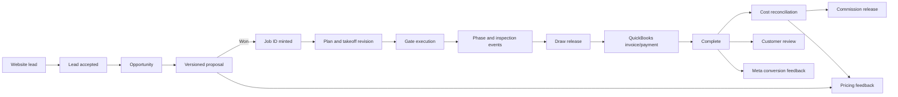

# Apex Unified Operating System Implementation Plan

> **For Hermes:** Use subagent-driven-development skill to implement this plan task-by-task.

**Goal:** Turn the existing Apex website, lead engine, proposal engine, Designer takeoff, Gate field app, customer view, scheduling, billing gates, and future accounting/commission work into one coherent operating system with shared identity, data, contracts, and audit history.

**Architecture:** Keep several purpose-built user interfaces, but give them one shared platform. A managed Postgres backend is the canonical operational store; shared TypeScript/Zod contracts define every entity and event; n8n handles external automation; QuickBooks remains the financial authority; Gate becomes the field-facing command center. Existing apps are migrated incrementally—no big-bang rewrite and no deletion of current artifacts until replacements are verified.

**Default tech stack:** TypeScript monorepo, pnpm workspaces, Astro/React for web surfaces, React PWA for Gate, existing pure TypeScript calculation engines, Supabase-managed Postgres/Auth/Storage as the default backend, n8n for orchestration/adapters, Vitest for unit/contract tests, Playwright for end-to-end tests, GitHub Actions for CI.

**Planning constraint:** This document is architecture and implementation sequencing only. Do not move, overwrite, archive, or rewrite the existing Apex projects until Nick approves the open decisions and explicitly says **go**.

---

## 1. Product thesis

Apex should be one system without becoming one giant application.

Each surface has one job:

| Surface | Primary user | One job |
|---|---|---|
| Apex Website | Prospect | Route the visitor and capture a tagged lead |
| Apex Sales / Proposal | Owner or salesperson | Convert scope into a versioned proposal |
| Apex Designer | Estimator / technical operator | Produce traceable plan and quantity calculations |
| Gate | Owner, superintendent, field lead | Show today's exceptions, irreversible hold points, and crew conflicts |
| Customer View | Customer | Explain progress, next steps, and approved photos without exposing internal QC |
| Apex Automations | System | Respond, notify, synchronize, and connect external services |
| QuickBooks | Bookkeeper / accountant | Own invoices, payments, expenses, and financial actuals |

The system-level promise is:

> Capture once, calculate once, approve once, and carry the same identifiers and evidence from the first click through reconciliation.

---

## 2. Canonical lifecycle



### Identifier rules

- `lead_id`: minted once by the website at submission.
- `opportunity_id`: minted when a lead is accepted into sales work.
- `proposal_id`: stable proposal identity; every edit creates `proposal_version`.
- `job_id`: minted once, only when a proposal becomes won/contracted.
- `takeoff_id`: stable takeoff identity; every accepted calculation set has a revision.
- `gate_instance_id`: one gate execution for one job and phase.
- `event_id`: globally unique, append-only operational event.
- QuickBooks IDs, Monday IDs, Meta IDs, and n8n execution IDs are external references, never Apex's primary identity.

---

## 3. System boundaries and authorities

### Canonical authorities

| Data | Authority |
|---|---|
| Lead and attribution | Apex Postgres |
| Proposal revisions | Apex Postgres |
| Geometry and quantities | Shared pool-engine package |
| Pricing and allowances | Shared pricing-engine package |
| Active job state | Apex Postgres event/state model |
| Gate definitions and signatures | Apex Postgres |
| Photos and documents | Object storage, referenced from Postgres |
| Customer-safe progress | Projection from approved Apex events |
| Invoices, payments, expenses | QuickBooks |
| Automation executions | n8n, linked back to Apex event IDs |
| Monday boards | Transitional scheduling/integration surface, not a competing authority |

### Hard rule

No entity may have two writable systems of record. If Monday remains in use, define exactly which fields it owns and which are read-only projections from Apex. The default recommendation is that Apex owns job state and Gate actions; Monday is transitional until Gate covers the required field workflow.

---

## 4. Target repository structure

```text
Apex/
├── apps/
│   ├── website/                 # Existing Astro marketing site
│   ├── office/                  # Leads, opportunities, proposals, job admin
│   ├── designer/                # Existing technical takeoff UI
│   ├── gate/                    # Mobile-first field PWA
│   └── customer/                # Tokenized customer progress view
├── packages/
│   ├── contracts/               # Zod schemas, TypeScript types, JSON Schema
│   ├── domain/                  # IDs, state machines, events, shared invariants
│   ├── pool-engine/             # Canonical geometry/quantity calculations
│   ├── pricing-engine/          # Cost codes, rates, allowances, margins
│   ├── gate-engine/             # Gate rules, freshness, evidence, signatures
│   ├── ui/                      # Shared visual tokens and basic components
│   └── api-client/              # Typed client generated from contracts
├── services/
│   ├── api/                     # Server-side commands and queries
│   └── automations/             # Versioned n8n source, fixtures, exports
├── supabase/
│   ├── migrations/              # Database schema and RLS policies
│   ├── seed/                    # Non-sensitive development fixtures
│   └── functions/               # Trusted webhook and command handlers
├── docs/
│   ├── prds/
│   ├── decisions/
│   ├── architecture/
│   ├── runbooks/
│   └── status.md                # Single current-state document
├── tools/
│   └── decks/                   # Deck generators
└── archive/                     # Clearly dated historical snapshots only
```

### Migration mapping

| Current folder | Target |
|---|---|
| `apex-website/apex-website` | `apps/website` |
| `Apex Designer` | `apps/designer` + extracted `packages/pool-engine` |
| `apex-proposal-engine` | `packages/pricing-engine` + proposal UI in `apps/office` |
| `apex-lead-engine/apex-lead-engine` | `services/automations` |
| `gate-v3.jsx` | prototype input for `apps/gate` |
| `apex-prds/apex-prds` | `docs/prds` and `docs/decisions` |
| `apex-decks` | `tools/decks` |
| `Apex ideas.zip` and superseded handoffs | `archive/YYYY-MM-DD/` after verification |

Do not perform this migration by copying files blindly. First create a root Git repository and remote backup, then preserve history from nested repositories where practical.

---

## 5. Core data model

### Primary entities

- `users`
- `roles`
- `customers`
- `leads`
- `opportunities`
- `proposals`
- `proposal_versions`
- `jobs`
- `job_contacts`
- `takeoffs`
- `takeoff_revisions`
- `gate_definitions`
- `gate_definition_versions`
- `gate_instances`
- `gate_check_results`
- `job_events`
- `crew_resources`
- `crew_assignments`
- `inspections`
- `draws`
- `chemistry_readings`
- `media_assets`
- `customer_portal_tokens`
- `external_references`

### Append-only job event envelope

```ts
const JobEvent = z.object({
  event_id: z.string().uuid(),
  job_id: JobId,
  event_type: z.string(),
  occurred_at: z.string().datetime(),
  recorded_at: z.string().datetime(),
  actor_id: UserId.nullable(),
  source: z.enum(["website", "office", "designer", "gate", "n8n", "monday", "quickbooks"]),
  idempotency_key: z.string(),
  payload: z.record(z.unknown()),
  external_references: z.array(ExternalReference).default([]),
});
```

Use database uniqueness on `event_id` and `idempotency_key`; do not rely on search-then-create workflows for exactly-once behavior.

### Gate model

A gate definition is versioned independently from a gate instance.

Each check supports:

- required or advisory
- evidence type: photo, reading, document, signature, none
- completion role
- source/citation
- freshness/expiration window
- automatic validation where possible
- override permission and required override reason

Signing freezes an immutable snapshot of:

- gate-definition version
- job and plan/takeoff revisions
- all check results
- evidence references
- signer identity and role
- signing timestamp
- device/source metadata
- overrides and reasons

A signed gate is never edited. Corrections create a superseding event.

---

## 6. Shared calculation authority

Apex currently has two independent calculation stacks. The target system must have one authority boundary.

### Pool engine owns

- pool/spa geometry
- water volume
- wetted area and waterline
- excavation geometry and soil-state quantities
- structural quantities from an approved standard detail
- hydraulics and equipment calculations
- finish and yard quantities
- plan-view quantitative annotations

### Pricing engine owns

- cost-code mapping
- verified unit-rate libraries
- direct-entry allowances
- fee/markup/margin treatment
- customer proposal totals
- commercial warnings and pricing completeness

### Relationship

```text
Job design input
→ pool-engine normalized quantities
→ versioned takeoff revision
→ pricing-engine cost-code lines
→ versioned proposal
```

The pricing engine must not maintain independent geometry formulas once the pool engine is accepted as authoritative.

### Required correctness work before integration

1. Model attached-spa excavation, shell, steel, deck, and plan geometry.
2. Roll hydraulic, gas, and operating failures into a unified blocking result.
3. Replace shallow job-file validation with complete runtime schemas.
4. Fix gas-table ordering and out-of-range refusal.
5. Eliminate duplicate physical facts such as shell thickness.
6. Add hard proposal input validation for zero/negative dimensions and fee rates.
7. Disable or repair `calibrate.mjs`.
8. Reconcile both engines against a second completed job not used for calibration.

---

## 7. Gate product scope

### Gate v1: one proven field slice

Build only:

1. Authenticated user opens today's action queue.
2. One real job appears.
3. One versioned pre-gunite gate appears.
4. Required checks can capture evidence.
5. Time-sensitive checks expire.
6. Authorized user signs the gate.
7. Immutable `gate.signed` event is written.
8. A draw becomes eligible for release.
9. Customer view advances to the safe milestone.
10. Every action survives reload and has an audit record.

Do not put chemistry, full scheduling, Meta uploads, reviews, commissions, or complete accounting into the first slice.

### Gate v2

- inspection request and result
- crew/day conflict detection
- photo capture and tagging
- watering/cure log
- task notes and mentions
- offline queue with safe retry/idempotency

### Gate v3

- startup chemistry readings and professionally approved treatment guidance
- subcontractor access
- customer notifications
- draw-to-QuickBooks integration
- review requests

### Customer view security

- unguessable, revocable, scoped token
- no internal costs, subcontractor names, QC comments, or gate details
- approved photos only
- token rotation and expiration support
- access logging

---

## 8. External integrations

### n8n

Use n8n for asynchronous orchestration, not canonical storage or business invariants.

Appropriate responsibilities:

- speed-to-lead SMS/email/team notification
- external system synchronization
- retries and operational alerts
- review requests
- Meta conversion uploads
- QuickBooks synchronization triggers

Business rules such as gate eligibility, legal transitions, identity, authorization, and idempotency must live in tested domain/API code and database constraints.

### QuickBooks

QuickBooks remains financial authority for:

- customer invoices
- payments
- vendor bills and expenses
- actual job costs
- accounting reconciliation

Apex stores linked external IDs and read models, not a competing ledger.

### Monday

Choose one of two explicit modes before implementation:

1. **Transitional adapter:** Monday displays selected Apex jobs/assignments but Apex owns status.
2. **Temporary job-state authority:** Gate commands update Monday through a trusted adapter until Apex Postgres takes ownership.

Do not allow bi-directional free editing without conflict rules.

---

## 9. Delivery phases

### Phase 0: Preserve and stabilize

**Objective:** Protect current work and remove known unsafe behavior before integration.

**Files:**
- Create: root `.gitignore`
- Create: root `README.md`
- Create: `docs/status.md`
- Create: `docs/decisions/ADR-0001-system-boundaries.md`
- Existing project files remain in place during this phase

**Steps:**

1. Back up the full current Apex folder.
2. Initialize a root Git repository without deleting nested repositories.
3. Configure a private remote and verify push/readback.
4. Record every existing dirty/untracked file before migration.
5. Mark stale ZIPs and handoffs as historical; do not delete yet.
6. Correct misleading deck claims about independent validation.
7. Create explicit launch blockers for Designer, Proposal, Website, and Lead Engine.
8. Run existing tests/builds and save the commands in `docs/status.md`.

**Verification:**

- Root source exists in a private remote.
- No productive source is lost.
- Current dirty working changes are preserved.
- `npm test` remains 299/299 for Designer and 90/90 for Proposal before correctness fixes begin.

### Phase 1: Create contracts and backend spine

**Objective:** Establish shared identity, database, auth, storage, and event contracts.

**Files:**
- Create: `pnpm-workspace.yaml`
- Create: root `package.json`
- Create: `packages/contracts/package.json`
- Create: `packages/contracts/src/*.ts`
- Create: `packages/domain/src/*.ts`
- Create: `supabase/migrations/*.sql`
- Create: `supabase/seed/development.sql`
- Test: `packages/contracts/src/*.test.ts`
- Test: `packages/domain/src/*.test.ts`

**TDD sequence:**

1. Write failing schema tests for canonical IDs and lead payload.
2. Implement Zod schemas and branded IDs.
3. Write failing transition tests for job lifecycle.
4. Implement legal transition graph.
5. Write failing idempotency/uniqueness database tests.
6. Add database constraints and transactional command handling.
7. Write failing RLS tests for office, field, subcontractor, customer, and admin roles.
8. Add policies until all role tests pass.

**Verification:**

- One contract package produces TypeScript types and JSON Schema.
- Website and n8n no longer maintain separate hand-written lead contracts.
- Duplicate event/idempotency inserts fail atomically.
- Unauthorized roles cannot read or mutate protected records.

### Phase 2: Prove lead-to-job-to-gate vertical slice

**Objective:** Demonstrate the full system spine with one real workflow.

**Files:**
- Modify: `apps/website/src/lib/lead.ts`
- Create: `services/api/src/commands/acceptLead.ts`
- Create: `services/api/src/commands/markProposalWon.ts`
- Create: `apps/gate/src/*`
- Create: `packages/gate-engine/src/*`
- Modify: `services/automations/workflows/*`
- Test: unit, contract, and Playwright tests for the whole slice

**Steps:**

1. Post a website lead to a trusted server endpoint.
2. Persist the lead transactionally.
3. Return an explicit accepted/duplicate/quarantined response contract.
4. Trigger n8n speed-to-lead only after durable acceptance.
5. Convert the lead to opportunity and proposal.
6. Mark proposal won and mint one immutable Job ID.
7. Show the job in Gate.
8. Complete and sign one pre-gunite gate.
9. Emit the immutable event.
10. Release one draw eligibility record.
11. Advance the customer-safe milestone projection.

**End-to-end acceptance test:**

A test lead can travel from the website through a signed gate and customer milestone without any ID regeneration or manual re-entry. Duplicate submissions and retries produce one lead, one job, and one gate-signing event.

### Phase 3: Unify takeoff and proposal calculations

**Objective:** Make one quantity engine feed the proposal engine.

**Files:**
- Extract: `apps/designer/src/engine/*` to `packages/pool-engine/src/*`
- Extract: proposal pricing logic to `packages/pricing-engine/src/*`
- Create: `packages/contracts/src/takeoff.ts`
- Create: `packages/contracts/src/proposal.ts`
- Add: reconciliation fixtures for at least two completed jobs

**Steps:**

1. Write failing regression tests for all known Designer defects.
2. Fix spa, failure rollup, gas bounds, and runtime validation.
3. Produce a normalized versioned takeoff result.
4. Remove duplicate geometry calculations from pricing.
5. Feed normalized quantities into pricing lines.
6. Add hard completeness gates before customer proposal generation.
7. Reconcile the calibration job.
8. Blind-test a second job.
9. Update decks only after independent validation passes.

**Verification:**

- Designer and Proposal report identical shared quantities for the same job revision.
- The second completed job meets the agreed tolerance without rate back-solving.
- No customer proposal can be generated with unresolved zero direct-entry scope unless an authorized override is documented.

### Phase 4: Expand Gate and customer operations

**Objective:** Add field evidence, scheduling, inspections, and customer communications without changing authorities.

**Files:**
- Add Gate modules under `apps/gate/src/features/*`
- Add domain modules under `packages/gate-engine/src/*`
- Add media policies and storage migrations
- Add customer projection tests

**Steps:**

1. Add evidence-backed gate checks.
2. Add check expiration/freshness.
3. Add photo capture, upload, and job tagging.
4. Add inspection request/result events.
5. Add crew assignments and conflict detection.
6. Add cure/watering logs.
7. Add customer-safe projection and revocable tokens.
8. Add offline command queue and idempotent replay.

### Phase 5: Financial and marketing adapters

**Objective:** Connect operational truth to accounting and growth systems.

**Dependencies:** QuickBooks structure, contract true-up method, commission policy, SMS provider, account ownership, and consent language must be signed off first.

**Steps:**

1. Sync released draws to QuickBooks draft invoices.
2. Import invoices, payments, bills, and job costs back into read models.
3. Reconcile estimate versus actual by shared cost code.
4. Trigger review request from completion eligibility.
5. Upload eligible won value to Meta with audit history.
6. Implement commission only after policy and legal/accounting approval.

---

## 10. Testing and quality gates

### Required test layers

- Unit tests for every pure engine and domain invariant
- Contract tests for every boundary
- Database tests for constraints and RLS
- Integration tests for n8n/API adapters
- Playwright tests for website, Gate, office, and customer flows
- Artifact tests for standalone takeoff HTML and print output
- Reconciliation tests against completed jobs
- Security tests for customer tokens and role isolation
- Retry/idempotency tests for every external command

### CI commands

```bash
pnpm lint
pnpm typecheck
pnpm test
pnpm test:contracts
pnpm test:db
pnpm test:e2e
pnpm build
pnpm audit --prod
```

Every pull request must pass all applicable checks. No deck, handoff, or status document may claim a feature is complete unless its acceptance tests are linked.

---

## 11. Operational requirements

- Structured logs include `lead_id`, `job_id`, `event_id`, and external execution IDs.
- Errors produce actionable alerts, not silent quarantines.
- Every webhook has authentication/signature where the sender can hold a secret.
- Public lead intake has payload limits, rate limiting, bot controls, and abuse monitoring.
- Photos and customer data have retention and access policies.
- Production/staging environments have separate credentials and analytics IDs.
- Database backups and restore drills are documented.
- Gate supports poor connectivity without duplicating commands.
- No hardcoded customer names, addresses, prices, or dates ship in production bundles.

---

## 12. Open decisions requiring Nick's approval

### Must decide before Phase 1

1. Use Supabase as the default managed Postgres/Auth/Storage platform, or self-host equivalent services?
2. Who needs access at launch: Nick, owner, superintendent, office staff, subcontractors?
3. Is Gate initially an internal tool only?
4. Is Monday temporary authority or a transitional display/adapter?
5. Which private Git host owns the Apex source?

### Must decide before Phase 2

6. What exact event creates a Job ID: signed contract, deposit received, or manual approval?
7. Which SMS/email provider sends speed-to-lead responses?
8. Who owns the production Apex accounts and credentials?
9. What makes a pre-gunite gate legally/operationally signable, and who may override it?
10. Which real job will be the first controlled Gate pilot?

### Must decide before Phase 5

11. QuickBooks company-file structure and Projects/Classes use
12. Allowance true-up language in the customer contract
13. Commission base, release gate, and reconciliation treatment
14. Lever B treatment in commission
15. Review-request consent and customer communication policy

---

## 13. Explicit non-goals for the first build

- Do not rewrite every existing UI.
- Do not build a general-purpose CRM.
- Do not replace QuickBooks.
- Do not create a custom accounting ledger.
- Do not implement full event sourcing infrastructure.
- Do not ship chemistry treatment automation before expert review.
- Do not expose internal QC data to the customer portal.
- Do not build commission logic before policy sign-off.
- Do not migrate every historical artifact before the vertical slice works.
- Do not let Monday and Apex both freely own the same status fields.

---

## 14. First milestone definition of done

The unified system has proven its architecture when one controlled job can demonstrate all of the following:

- [ ] Tagged lead accepted once
- [ ] Automated response recorded with timestamp
- [ ] Opportunity and versioned proposal created
- [ ] Job ID minted once at the approved business event
- [ ] Technical takeoff revision attached to the job
- [ ] Pre-gunite gate generated from a versioned definition
- [ ] Evidence captured for required checks
- [ ] Gate signed by an authorized user
- [ ] Immutable event and audit history stored
- [ ] Draw becomes eligible from the signed gate
- [ ] Customer-safe milestone advances
- [ ] Duplicate and offline retries do not duplicate records
- [ ] Every surface displays the same Job ID and current state
- [ ] Build, tests, security checks, and backup restore verification pass

Only after this slice works should Apex expand into complete scheduling, chemistry, accounting synchronization, reviews, Meta uploads, and commissions.

---

## 15. Recommended execution order

1. Approve this architecture and answer the Phase 1 decisions.
2. Preserve current source in a root private remote.
3. Fix the known calculation safety defects.
4. Create shared contracts and the canonical database.
5. Build the one-job lead-to-gate vertical slice.
6. Unify Designer quantities with Proposal pricing.
7. Expand Gate carefully around the proven event model.
8. Add external accounting and marketing adapters last.

This order protects the best existing ideas while avoiding another round of disconnected prototypes.
