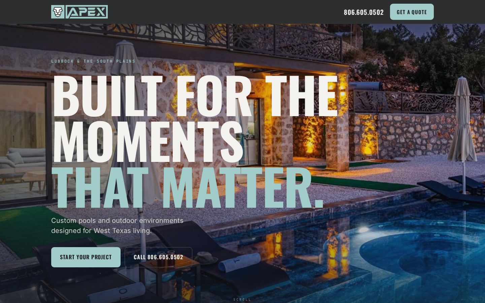
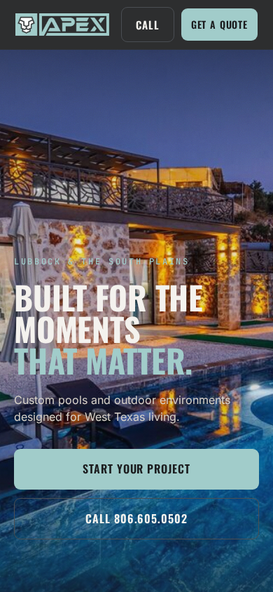



# feat(website): rebuild the homepage as V2 — cinematic, brand-first, pools-led

> **Homepage V2 design/code complete — final proprietary photography and brand film pending.**
> Not launch-ready until real Apex photography is in place (D-20). Every image below is a
> licensed stock placeholder, truthfully captioned.

Rebuilds the Apex home page from first principles against a fixed narrative spine:

```
DESIRE → EMOTION → CRAFTSMANSHIP → PROOF → TRUST → CAPABILITY → CONVERSION
```

| # | Section | Beat | Component |
|---|---|---|---|
| 01 | Hero | Desire | `home/Hero.astro` + `home/HeroMedia.astro` |
| 02 | Beauty above / engineering beneath | Craftsmanship | `home/Craft.astro` |
| 03 | The work | Proof | `home/Showcase.astro` |
| 04 | Outdoor living | The world | `home/Living.astro` |
| 05 | The Apex Standard | Trust | `home/Standard.astro` |
| 06 | Four specialties | Capability | `home/Capability.astro` |
| 07 | Process + close | Conversion | `home/Close.astro` |

The old page put the entire site hierarchy above the fold — subhead, a three-up warranty strip,
a router question, four tiles — then stacked more sections of similar weight below it, so it had
one flat register and no pacing.

---

## Hero media interface

`src/content/hero-media.ts` is a single `poster → playback → scrub` contract rendered by **one**
component. Only `poster` ships.

- A mode whose film is `null` **throws at build time** rather than silently rendering a poster forever.
- `scrub` is deliberately **not stubbed** — a mode that is accepted but ignored is a promise the
  code doesn't keep, and a half-built scrub path is exactly the complexity this rebuild removes.
- The poster is the LCP element in *every* state, so adding video later cannot regress it.

D-22's rule against independently generated frames is reinforced: the source of truth is **one
continuous approved clip**, and any future frames are extracted deterministically from that file.
No frames were generated and no AI cinematic sequence was fabricated.

---

## The four verticals are not orphaned

The four-tile router was the *only* set of links from the home page to `/coating`, `/renovation`
and `/service` — all three have live SEO. It left the hero, but the verticals are reached from a
typographic index in Section 06 which keeps **both** actions the old cards had:

- a link to the vertical's landing page, and
- a link to `#quote` carrying `data-preselect`, so the form opens on the right vertical
  (the AC-2.2 contract, unchanged — read at click time by `QuoteSection`'s inline script).

Reachability is asserted in three independent places: `homepage-v2.spec.ts`, the rebuilt
`lead-capture.spec.ts` AC-2.1, and `validate.mjs` against the built HTML.

---

## Truthfulness preserved

There is no real Apex photography (D-20). Therefore:

- Every V2 slot is flagged `stock: true`.
- **No alt text claims the imagery is Apex's work** — enforced by `tests/imagery.spec.ts`, which
  fails on any stock alt matching `/apex/i` or `/travis/i`.
- **No project is named.** Section 03's labels describe the *image* ("Dusk environment"), not a
  job, location or client. When projects are documented those become names — content-only change.
- Swapping real photography in is a content change in `content/images.ts` only: drop the file,
  clear `stock`, and rewrite the alt **in the same edit**.

---

## Validation

### New: `pnpm validate` — the one command that proves the site builds

The root `pnpm build` runs `tsc -b`, which **never builds the website**. It passes identically if
`src/pages/index.astro` does not exist, so it is not evidence that the homepage renders.
`scripts/validate.mjs` runs `astro check` → real `astro build` → asserts against `dist/`:

routes built · all seven sections present · exactly one `<h1>` · hero in its declared mode ·
no `<video>` before a film exists · all four verticals linked · every internal link and image
resolves · client-JS budget.

`preflight` is **reported, not enforced** — its blockers are environment-dependent facts about a
deployable bundle (non-production `robots.txt`, uninlined webhook URL) that say nothing about
code correctness, and two are standing blockers on the base branch. It remains the deploy gate.

### Results

| Check | Result |
|---|---|
| `astro check` | 0 errors, 0 warnings |
| Production build | ✅ 7 pages |
| `pnpm validate` | ✅ all dist/ assertions pass |
| Playwright | ✅ **154 / 154** |
| Console errors @ 1440 / 820 / 390 | ✅ none |
| Horizontal overflow @ 1440 / 820 / 390 | ✅ none |
| Reduced motion | ✅ renders fully, no hidden content |
| Client JS for the visual system | ✅ none |

---

## Bugs found and fixed

1. **`global.css` targeted the site chrome with a bare `header` selector.** Homepage V2 uses a
   semantic `<header class="sec-head">` for each section intro — correct HTML — which that
   selector also matched, painting every section heading the charcoal nav background and dropping
   the body copy below contrast. Scoped to `body > header`. *Caught only by visual review;
   build, typecheck and unit tests were all green.*
2. **The full-bleed bands and mobile founder portrait overrode `aspect-ratio`**, silently removing
   the AC-9.1 no-layout-shift reservation. Both now cap with `max-height` and re-frame with
   `object-position`.
3. **On a 390px phone, "Get a Quote" wrapped to two lines inside its own button.** Tightened the
   header below 720px with `nowrap`.
4. **The hero was a 16:9 source**, which reduced to a narrow sliver of patio furniture with no
   water on a phone. Re-sourced at 4:5 — near-native to mobile, covers desktop by cropping top
   and bottom — and retuned the scrim, which was crushing the bottom 40% (where the water is) to
   near-black.

## Obsolete tests updated, not worked around

No obsolete UI was preserved to keep a test green.

| Test | Change |
|---|---|
| `reduced-motion.spec.ts` | "four router tiles" → every home CTA visible and ≥44px, capability index has 4 visible links, hero poster renders. The *requirement* is preserved; the obsolete implementation is not. |
| `lead-capture` AC-2.1 | tile count → the index's four `data-preselect` links, in enum order |
| `lead-capture` testimonials | three-card grid CSS → pull-quote present, attributed, real `<blockquote>` |
| `lead-capture` financing | two copies → one (the other was in the deleted `PoolsSection`); also asserts `rel="noopener"` |
| `lead-capture` AC-1.2 | `setTimeout(120_000)` — four navigations + four hydrations in one body; per-assertion timeouts unchanged |
| `homepage-v2.spec.ts` | **new** — section order, single `<h1>`, vertical reachability, hero media contract, overflow at 3 widths, client-JS budget |

## Retired

No cinematic implementation existed to quarantine — the last four commits before this branch were
markdown only. No cleanup workstream was manufactured. Deleted: `Hero.astro`,
`PoolsSection.astro`, `MoreVerticals.astro`, `Owner.astro`, and the dead CSS that went with them
(`.router`, `.tiles`, `.tile`, `.pool-grid`, `.vcard`, `.pstep`, the old `.hero` block, the
full-bleed SVG `.grain`). Everything still used by `pages/[vertical].astro` was kept.
Recoverable from tag `pre-homepage-v2` (`2ebb470`).

---

## Screenshots

| Desktop | Mobile |
|---|---|
|  |  |

<details>
<summary>Full page — desktop & mobile</summary>




</details>

## Media state — explicit

**Homepage V2 design/code complete — final proprietary photography and brand film pending.**

**Do not describe the photography as launch-ready.** The shot list for the shoot is in
`docs/homepage-v2.md` §7 and is reproducible via `npm run check:images`. The brand film is a
separate workstream and does not block launch.

🤖 Generated with [Claude Code](https://claude.com/claude-code)
